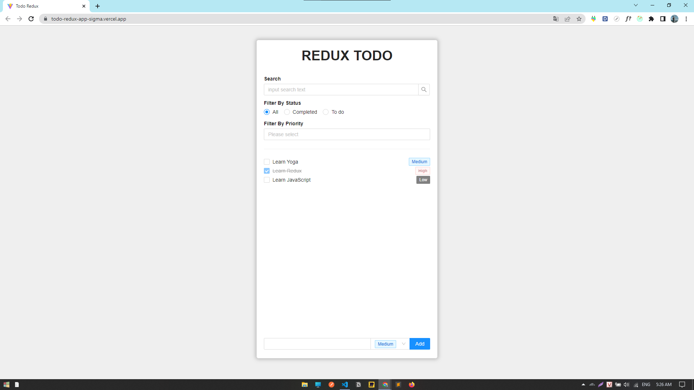

# Todo Redux App
Xây dựng 1 ứng dụng todolist bằng Redux Core

## Screenshots

**[My Demo App in Vercel](http://todo-redux-app-sigma.vercel.app/)**


## Features
- Thêm mới công việc cần làm và lựa chọn độ ưu tiên cho từng công việc
- hiển thị danh sách việc cần làm
- bắt sự kiện onClick để đánh dấu công việc đã hoàn thành
- Tìm kiếm công việc dựa trên: tên công việc, trạng thái công việc (đã hoàn thành hay chưa) và độ ưu tiên công việc.


## Technology Used
- sử dụng redux core để quản lý state: danh sách công việc và filter

# Kiến trúc Redux
3 thành phần cơ cơ bản của redux:

### REDUCERS 
là 1 function được sử dụng để cập nhật lại giá trị của state bên trong 1 cái store.
Reducer bên trong store như 1 nơi để chúng ta đăng ký hành động xử lý 1 cái gì đó khi có lời gọi tương ứng.

```javascript
const initValue = { value : 0 }

const rootReducer = (state = initValue, action) => {
    switch(action.type) {
        case 'INCREMENT':
            return {
                ...state, 
                value: state.value + 1
            }
    // {
    //  type: 'todoList/increment',
    //  payload: 10
    // }
        case 'todoList/increment': 
            return {
                ...state,
                value : state.value + action.payload
            }
    }
}
```
### 2. **Nguyên lý hoạt động:**

1️⃣ khi thằng rootReducer được khởi tạo, thì nó sẽ nhận vào 1 giá trị khởi tạo là 1 cái object được định nghĩa trước đó.

2️⃣ ở bên trong thằng reducer này nó đi kiểm tra dựa trên action đang là action  gì → thì nó sẽ đi thực hiện đoạn code logic để cập nhật lại giá trị state tương ứng.

3️⃣ trường hợp nó là increment → thì nó sẽ tiến hành cập nhật lại state bằng cách (**Immutability** ) coppy thằng …state hiện tại và cập nhật lại 1 cái fil là value

0️⃣ Ngoài ra khi chúng ta sử dụng switch chúng ta luôn luôn phải có 1 thằng default (để khi nhận 1 action không thỏa mãn bất kì cái case được định nghĩa nào thì nó sẽ rơi vào trường hợp default) → đa số trường hợp này chỉ cần trả về cái state hiện tại.

### ACTION 
Action trong redux nó chỉ đơn giản là 1 object do chúng ta quy định thôi. 
Dùng để mô tả hành động gửi lên cho reducer để xử lý logic

```js
const INCREMENT = {
    type: 'todoList/increment',
    payload: 10
}

//  Action creators
const increamentCreator = () => {
    return {
        type: 'todoList/increment',
        payload: 10
    }
}
```
### Khái niệm Action Creators

**Là gì ?**

nó là 1 cái fn để tạo ra 1 cái action

**Cú pháp**

```jsx
//action createtor
const increamentCreator = (data) => {
    return {
        type: 'todoList/increment',
        payload: data
    }
}
```

**Công dụng**
nó giúp chúng ta không phải viết những cái object lặp đi lặp lại

### DISPATCH
Cơ bản nó là 1 funtion dùng để gửi (Mô tả action) lên cho reducer thực thi

```js
    //step 1:
    dispath(INCREMENT)
    
    //step 2:
    dispath(increamentCreator(5))

```

### 3. Nguyên lý hoạt động

1️⃣ khi trên UI có 1 hành động nào đó từ user → sự kiện onClick đó sẽ gọi đến dispath 

2️⃣ bên trong dispath đó nó sẽ có chứa (mô tả hành động) và công việc của dispath là gửi cái mô tả hành động đó lên store  

3️⃣ Reducer trong store sẽ nhận được dữ liệu này → thực thi logic → cập nhật lại state.